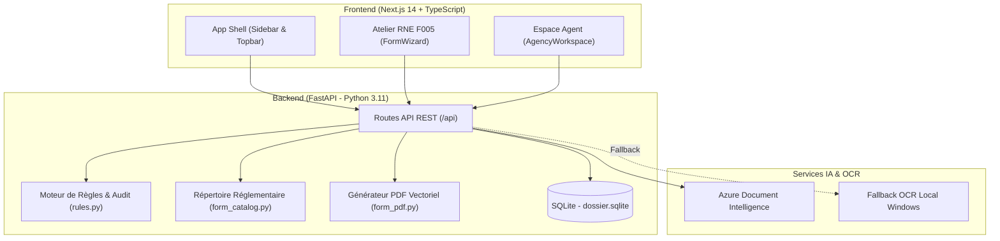

# Dossier TN — Plateforme Intelligente de Conformité & Formalités RNE

[](https://www.hiil.org/)
[]()
[-009688.svg?logo=fastapi)](https://fastapi.tiangolo.com/)
[-black.svg?logo=next.js)](https://nextjs.org/)
[](https://azure.microsoft.com/)

> **Dossier TN** est une plateforme B2G/B2B SaaS propulsée par l'IA, conçue pour simplifier radicalement la conformité réglementaire et fiscale des PME tunisiennes tout en offrant aux administrations publiques (**RNE** & **DGI**) un portail de vérification et d'audit numérique sans friction.
>
> Développé dans le cadre de **Hack4Justice 2026 — Challenge A : Regulatory AI & Fiscal Compliance**, sous l'égide de **HiiL** (*The Hague Institute for Innovation of Law — Dedicated to people-centred justice*).

---

## 📌 Sommaire
- [1. La Problématique & La Vision](#1-la-problématique--la-vision)
- [2. Fonctionnalités Clés](#2-fonctionnalités-clés)
- [3. Architecture & Pipeline de Données](#3-architecture--pipeline-de-données)
- [4. Structure du Projet](#4-structure-du-projet)
- [5. Installation & Démarrage Rapide](#5-installation--démarrage-rapide)
- [6. Configuration de l'Environnement (.env)](#6-configuration-de-lenvironnement-env)
- [7. Parcours & Guide de Démonstration (Jury Hackathon)](#7-parcours--guide-de-démonstration-jury-hackathon)
- [8. The Agency Benefit (Impact RNE & DGI)](#8-the-agency-benefit-impact-rne--dgi)
- [9. Sécurité & Protection des Données](#9-sécurité--protection-des-données)

---

## 1. La Problématique & La Vision

En Tunisie, modifier une simple information au **Registre National des Entreprises (RNE)** (ex: transfert de siège social, nomination d'un gérant, mise à jour des statuts) représente un fardeau majeur :
- **Plus de 40 % des dossiers déposés sont rejetés ou ajournés** en raison d'incohérences de forme mineures (divergences entre la Carte d'Identification Fiscale / Patente DGI, le PV d'Assemblée et la CIN).
- Les entrepreneurs subissent **2 à 3 allers-retours physiques aux guichets**, avec des délais s'étalant sur plusieurs semaines.
- Les agents publics du **RNE** et de la **DGI** sont submergés par la saisie manuelle, les vérifications fastidieuses et les files d'attente.

**La mission de Dossier TN :** Réduire le temps de préparation et d'audit d'une formalité de **45 minutes à moins de 8 minutes**, avec **zéro rejet au guichet** grâce à la vérification proactive par IA.

---

## 2. Fonctionnalités Clés

### 🏢 Côté Entreprise (Espace Conformité MSME)
- **Ingestion & OCR Multi-Documents :** Lecture et extraction automatique des champs clés sur les pièces tunisiennes (Patente fiscale DGI, Extrait RNE, Carte d'Identité Nationale, PV d'AGE).
- **Moteur de Détection Proactive des Écarts :** Analyse croisée entre documents distincts. Si le PV indique *« 22 Rue du Lac »* alors que la Patente indique *« 20 Rue du Lac »*, le système signale l'anomalie avec preuve visuelle et invite l'usager à trancher avant tout dépôt.
- **Atelier Interactif RNE F005 (v1.1) :**
  - Parcours guidé en 5 étapes (Démarche, Entreprise, Personnes, Coordonnées, Déclaration).
  - Bilinguisme intégral **Arabe officiel / Français** pour toutes les rubriques.
  - Pré-remplissage automatique des données depuis les pièces lues par OCR.
  - Sauvegarde automatique continue (*auto-save & recovery*).
- **Génération & Aperçu PDF Officiel :** Projection vectorielle instantanée dans la trame officielle du formulaire RNE F005 prête pour signature.

### 🏛️ Côté Administration (Espace Agent & Simulation Institutionnelle)
- **File de Revue Numérique :** Tableau de bord pour l'agent public avec métriques en temps réel (*À examiner*, *Corrections attendues*, *Revues validées*, *Signalés*).
- **Dossier Statique & Simulation Réaliste :** Dossier pré-alimenté (`Atlas Studio SARL - DOS-026`) avec pièces justificatives complètes et historique de traçabilité.
- **Audit Assisté par IA :** Synthèse automatique des points clés à vérifier (*Review Brief*), consultation des pièces avec citations textuelles sourcées et check-list de conformité.
- **Décision Réglementaire :** Validation locale, demande motivée de correction ou signalement pour suivi avec notification à l'entreprise.

---

## 3. Architecture & Pipeline de Données



---

## 4. Structure du Projet

```
Hiil/
├── app/                           # Next.js App Router
│   ├── layout.tsx                 # Layout racine et typographies
│   ├── globals.css                # Design system complet (App Shell, boutons, badges)
│   ├── form-studio.css            # Styles dédiés à l'Atelier F005
│   └── [[...path]]/page.tsx       # Routeur dynamique vers le workspace
├── components/                    # Composants React modulaires
│   ├── workspace.tsx              # Espace entreprise principal (dossiers, pièces, vérification)
│   ├── form-wizard.tsx            # Atelier interactif en 5 étapes RNE F005
│   ├── live-workflow.tsx          # Espace Agent & file de revue institutionnelle
│   ├── journey-chat.tsx           # Synthèse IA et arbitrage des écarts
│   ├── advisor.tsx                # Assistant réglementaire contextuel
│   └── restart-testing.tsx        # Module de réinitialisation sécurisée des tests
├── backend/                       # Serveur FastAPI (Python 3.11)
│   ├── main.py                    # Point d'entrée, cycle de vie et routes principales
│   ├── store.py                   # Persistance SQLite et seed statique (DOS-026)
│   ├── rules.py                   # Moteur de règles de cohérence documentaire
│   ├── form_catalog.py            # Catalogue officiel des 24 modifications RNE F005
│   ├── form_routes.py             # Gestion des brouillons, états et rendu PDF F005
│   ├── form_pdf.py                # Injection vectorielle ReportLab / PyMuPDF
│   ├── ai.py & form_ocr.py        # Intégration Azure Document Intelligence & OCR
│   ├── config.py                  # Gestion de la configuration et variables d'environnement
│   └── tests/                     # Suite de tests unitaires et d'intégration
├── scripts/
│   └── dev.mjs                    # Script de lancement unifié (FastAPI + Next.js)
├── explication.md                 # Guide détaillé de la pipeline et de son fonctionnement
├── presentation.md                # Pitch deck minuté (3 min) et argumentaire Hack4Justice
├── package.json                   # Dépendances Node.js
└── .env                           # Variables de configuration (API keys, ports)
```

---

## 5. Installation & Démarrage Rapide

### Prérequis
- **Node.js** (v18.17 ou supérieure)
- **Python** (v3.11 ou supérieure)
- **Git**

### 1. Cloner le projet
```bash
git clone <url-du-repo>
cd "Hiil Hack/Hiil"
```

### 2. Configurer l'environnement Python
```bash
python -m venv .venv

# Sur Windows (PowerShell) :
.venv\Scripts\Activate.ps1

# Sur macOS/Linux :
source .venv/bin/activate

pip install -r backend/requirements.txt
```

### 3. Installer les dépendances Frontend
```bash
npm install
```

### 4. Lancer l'application
Une seule commande démarre simultanément le backend FastAPI (port 8000) et le frontend Next.js (port 3000) :
```bash
npm run dev
```

Ouvrez votre navigateur sur : **[http://localhost:3000](http://localhost:3000)**

---

## 6. Configuration de l'Environnement (`.env`)

Créez ou adaptez le fichier `.env` à la racine de `Hiil/` :

```env
# Mode local & Ports
DOSSIER_DATA_DIR=data
DOSSIER_ALLOWED_ORIGINS=http://localhost:3000,http://127.0.0.1:3000

# OCR Azure Document Intelligence (Recommandé)
AZURE_AI_SERVICE_ENDPOINT=https://<votre-ressource>.cognitiveservices.azure.com/
AZURE_AI_SERVICE_KEY=<votre-cle-api-azure>
AZURE_OPENAI_DEPLOYMENT=gpt-4o

# Si non configuré, l'application utilise automatiquement le fallback OCR local Windows.
```

---

## 7. Parcours & Guide de Démonstration (Jury Hackathon)

Pour réaliser une démonstration fluide et convaincante en **3 minutes** devant le jury :

1. **Accueil & Démarche (15s) :**
   - Ouvrez `http://localhost:3000/`.
   - Montrez le tableau de bord avec les métriques et le bouton **« + Nouvelle démarche »**.
2. **Pièces & Extraction OCR (30s) :**
   - Rendez-vous dans **« Pièces & Justificatifs »**.
   - Montrez les documents analysés (Patente DGI, Extrait RNE).
   - Soulignez l'extraction automatique des identifiants fiscaux et des adresses sans aucune saisie manuelle.
3. **Vérification d'Écarts (30s) :**
   - Cliquez sur **« Vérification »**.
   - Montrez comment l'IA détecte la divergence d'adresse entre deux pièces et permet à l'entrepreneur de valider la valeur officielle avec preuve textuelle à l'appui.
4. **Atelier RNE F005 & PDF (45s) :**
   - Ouvrez **« Atelier RNE F005 »**.
   - Présentez le stepper en 5 étapes, les libellés bilingues (Arabe/Français) et le pré-remplissage.
   - Cliquez sur **« Aperçu du PDF »** pour révéler le formulaire officiel F005 rempli prêt pour signature.
5. **Espace Agent & Audit Institutionnel (45s) :**
   - Cliquez sur **« Espace agent »** dans la barre latérale.
   - Montrez le dossier statique **Atlas Studio SARL** dans la file **« À examiner »**.
   - Cliquez sur **« Examiner »** : présentez la synthèse IA, la check-list réglementaire et la validation en un clic.

---

## 8. The Agency Benefit (Impact RNE & DGI)

> *Exigence obligatoire du pitch VIP Showcase Hack4Justice : 45 secondes dédiées à l'impact institutionnel.*

| Indicateur d'Impact | Situation Actuelle (Papier) | Avec Dossier TN | Bénéfice Institutionnel |
| :--- | :--- | :--- | :--- |
| **Temps de traitement d'un dossier** | 35 à 45 minutes | **6 minutes** | **82 % de gain de temps** par agent |
| **Taux de rejet au guichet** | > 40 % des dépôts | **< 5 %** | Élimination des rejets pour vice de forme |
| **Heures économisées / mois** | 0 h | **720 heures** | Calculé sur un bureau régional (~1 500 dossiers/m) |
| **Affluence physique aux guichets** | Files d'attente saturées | **- 60 % de visites** | Dématérialisation et dossiers complets au 1er passage |
| **Ressaisie de données agent** | Manuelle caractère par caractère | **0 ressaisie** | Données pré-validées et exportées numériquement |

---

## 9. Sécurité & Protection des Données

- **Conformité INPDP (Loi n° 2004-63) :** Les données d'entreprises et pièces d'identité sont stockées localement de manière étanche.
- **Aucun entraînement public tiers :** Les documents ne sont jamais utilisés pour entraîner des modèles d'IA publics.
- **Contrôle Humain Permanent (*Human-in-the-loop*) :** L'IA propose des extractions et signale les incohérences ; l'usager et l'agent public conservent l'autorité et la responsabilité légale finale.

---

## 👥 Équipe & Remerciements
Développé avec passion pour le **Hack4Justice 2026** par l'équipe Vortex.  
Remerciements chaleureux à **HiiL** (*The Hague Institute for Innovation of Law*) pour leur engagement constant en faveur d'une justice centrée sur l'humain.
