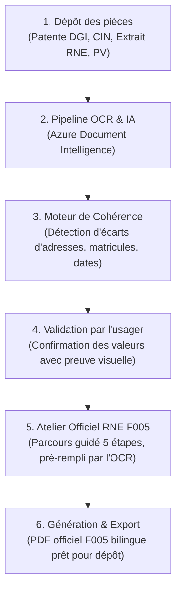

# Dossier TN — Guide & Explication de la Pipeline

---

## 1. Le Schéma de la Pipeline (De bout en bout)



---

## 2. Guide d'utilisation pratique : Comment s'en servir pas à pas

Voici le parcours utilisateur exact à suivre sur votre écran (`http://localhost:3000`) :

```
Vue d'ensemble ──▶ Pièces & Justificatifs ──▶ Vérification ──▶ Atelier RNE F005 ──▶ Préparation & Export
```

### Étape 1 : Créer ou ouvrir un dossier
- Sur la page d'accueil ou dans **« Mes démarches »**, cliquez sur le bouton bleu **« + Nouvelle démarche »**.
- Saisissez le nom d'une entreprise (par exemple : *« Jasmin Services SARL »*).
- Votre dossier est créé instantanément avec un identifiant unique (ex: `DOS-XXXXXX`).

### Étape 2 : Déposer les documents de l'entreprise
- Allez dans l'onglet **« Pièces & Justificatifs »** (ou suivez le lien du dossier).
- Glissez-déposez vos fichiers (fichiers PDF, scans ou photos de votre **Patente**, de votre **CIN**, ou de votre **Extrait RNE**).
- Cliquez sur le bouton **« Analyser »** à côté du document.
- **Ce qui se passe :** Le backend envoie le document au moteur OCR (Azure Document Intelligence). L'IA lit le texte, repère les libellés officiels tunisiens et extrait les données :
  - Dénomination sociale
  - Identifiant fiscal unique (Matricule fiscal DGI)
  - Adresse du siège
  - Nom et numéro CIN du représentant légal

### Étape 3 : La Vérification & Résolution des écarts
- Cliquez sur l'étape **« Vérification »** (ou sur le bouton orange **« Vérifier »**).
- **La magie opère ici :** Si votre Patente indique par exemple *« 20, Rue du Lac »* et que votre Extrait RNE ou PV indique *« 22, Rue du Lac »*, l'application refuse de laisser passer l'erreur.
- L'écran affiche un bandeau comparatif côte à côte avec les deux passages surlignés dans les documents originaux.
- Vous sélectionnez la valeur légale à retenir et cliquez sur **« Confirmer la valeur »**.
- **Pourquoi c'est crucial pour le jury :** C'est précisément cette divergence qui cause le rejet de 40 % des dossiers au guichet du RNE. Dossier TN résout le problème avant le dépôt.

### Étape 4 : L'Atelier RNE F005 (Le formulaire officiel)
- Cliquez sur l'onglet **« Atelier RNE F005 »** dans la barre latérale.
- Vous êtes guidé à travers les **5 étapes réglementaires** :
  - **Étape 1 (Votre démarche) :** Cochez ce qui change dans l'entreprise (ex: *Transfert de siège social*, *Changement de gérant*). Chaque case a son intitulé en français et en arabe officiel (ex: تغيير المقر الاجتماعي).
  - **Étape 2 (L'entreprise) :** Vos informations (Dénomination, Matricule, Identifiant) sont **déjà pré-remplies** grâce à l'OCR ! Vous pouvez aussi cliquer sur *« Reprendre les informations d'une pièce »* pour importer automatiquement les données d'une CIN ou d'une patente.
  - **Étape 3 (Les personnes) :** Indiquez le représentant légal et cochez *« Cette personne fait aussi la déclaration »* pour éviter toute double saisie.
  - **Étape 4 (Coordonnées) :** Vérifiez l'adresse, l'email et le téléphone.
  - **Étape 5 (Votre déclaration) :** Contrôle final automatique. Le système vérifie qu'aucun champ légal obligatoire ne manque.
- Cliquez sur **« Vérifier l'aperçu du PDF »** pour visualiser le formulaire officiel RNE F005 généré en temps réel.
- Cliquez sur **« Préparer mon PDF »**.

### Étape 5 : Téléchargement & Revue
- Votre déclaration est prête ! Vous pouvez :
  - Télécharger le **formulaire F005 officiel en PDF** rempli et normé.
  - Télécharger le **dossier complet d'export** (avec les pièces justificatives jointes).
- Le dossier peut être transmis à l'espace de revue de l'agent public.

---

## 3. Ce qui se passe sous le capot (L'architecture technique)

| Composant | Fichiers clés | Rôle dans le pipeline |
| :--- | :--- | :--- |
| **Frontend (UI & Navigation)** | `components/workspace.tsx` | Structure globale (App Shell), tableau de bord des démarches, métriques et gestion des onglets. |
| **Atelier F005 (Wizard)** | `components/form-wizard.tsx` | Parcours guidé en 5 étapes, synchronisation d'état réactive (draft autosave), bilinguisme arabe/français. |
| **Moteur OCR & IA** | `backend/ai.py`, `backend/config.py` | Connexion à **Azure Document Intelligence** pour l'extraction de texte et de formulaires structurés (avec fallback OCR Windows local). |
| **Règles métier & Audit** | `backend/rules.py` | Analyse des contradictions entre pièces (comparaison de faits, détection de divergences d'adresses ou de dates). |
| **Répertoire réglementaire** | `backend/form_catalog.py` | Définition stricte des 24 types de modifications statutaires du RNE, de leurs règles de visibilité et d'obligation. |
| **Générateur PDF** | `backend/form_routes.py` | Projection vectorielle des données saisies directement dans la grille officielle du formulaire RNE F005. |

---

## 4. Comment faire une démo en 60 secondes pour convaincre le jury

Pour votre présentation, suivez ce scénario simple :
1. **Montrez l'accueil (5s) :** *« Voici Dossier TN, le tableau de bord où l'entrepreneur centralise ses démarches RNE. »*
2. **Montrez une pièce analysée (15s) :** Allez dans **Pièces & Justificatifs**, montrez la patente ou la CIN avec ses champs extraits automatiquement par OCR (*« Pas de saisie manuelle : l'IA a reconnu le matricule fiscal et l'adresse »*).
3. **Montrez la vérification d'écart (20s) :** Allez dans **Vérification** (*« Ici, les deux documents avaient une adresse légèrement différente : l'application alerte l'usager et lui fait confirmer la bonne valeur avant le dépôt »*).
4. **Montrez l'Atelier F005 et le PDF (20s) :** Ouvrez **Atelier RNE F005**, montrez le formulaire bilingue français/arabe pré-rempli et cliquez sur **Aperçu du PDF** (*« En un clic, le formulaire officiel F005 v1.1 conforme aux exigences du RNE est généré sans aucune erreur »*).
